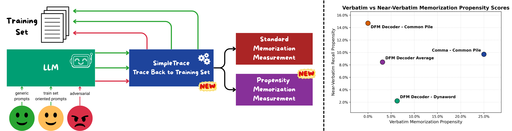

# PropMe

<p align="center">
    
</p>

---

PropMe is a propensity-aware framework for memorization evaluation in large language models. It compares ordinary, non-adversarial generations against prefix-style capability attacks and reports how strongly a model tends to leak training data under realistic use versus how much it can be induced to do so.

`SimpleTrace` is the tracing component that makes PropMe possible in practice. It is a lightweight offline tracing pipeline built on top of `infini-gram`: it indexes a training corpus, traces generations back to matching training documents, and computes the summary metrics used by the PropMe analysis.

The repository accompanies the paper:

> "LLMs Can Leak Training Data But Do They Want To? A Propensity-Aware Evaluation of Memorization in LLMs"

## Requirements

- Python `3.11.9` or higher.
- The dependencies in `requirements.txt`

Install using:

```bash
python -m venv .venv
source .venv/bin/activate
python -m pip install -r requirements.txt
```

## Workflow

The top-level PropMe workflow is:

1. Prepare the dataset files you want to index.
2. Build an InfiniGram index for the corpus you want to trace against.
3. Precompute unigram probabilities for the indexed corpus.
4. Generate model completions for the prompt settings you want to compare.
5. Run `SimpleTrace` on the generated completions.
6. Compute PropMe metrics from the traced summaries.
7. Optionally run validation scripts and bundled experiment presets.

The detailed commands for each step are documented in the folder READMEs:

- `01_indexing/README.md`: InfiniGram indexing.
- `02_unigram_probs/README.md`: unigram probability precomputation.
- `03_tracing/README.md`: running `SimpleTrace` on generations.
- `04_validation/README.md`: validation workflows and outputs.
- `05_propensity_metrics/README.md`: PropMe metric computation.
- `memorization_experiment/README.md`: prompt generation, bundled experiment presets, and plotting.
- `preprocess.md`: additional dataset preparation, indexing, and unigram notes.

## Details

### What PropMe measures

We distinguish between:

- `capability`: whether a model can be induced to reproduce training data under adversarial prompting,
- `propensity`: whether it tends to reproduce training data under ordinary, non-adversarial use.

In this repository, the capability setting is represented by `prefix` prompts, while ordinary-use settings are represented by `generic` and `specific` prompts. `SimpleTrace` turns generations from each setting into document-level overlap summaries, and `compute_propensity_metrics.py` transforms those summaries into propensity-style scores.

The current implementation computes a propensity score for a scalar metric `m` as:

```text
propensity_m = 0.5 * (1 + (non_prefix_m - prefix_m) / (|non_prefix_m| + |prefix_m|))
```

When both values are `0`, the implementation returns `0.0`.

### What SimpleTrace does

For each generation, `simple_trace.py` runs an offline tracing pipeline:

1. Tokenize the generation and query the InfiniGram index for candidate exact or partial matches.
2. Filter candidate spans.
3. Rank spans by unigram rarity.
4. Retrieve matching source documents and merge overlapping traced regions.
5. Compute summary metrics over the retrieved matches.

Compared with earlier informal tracing scripts inspired by OLMoTrace, this repository adds the missing end-to-end pieces needed for systematic research use:

- corpus indexing,
- unigram precomputation,
- multi-worker batch tracing,
- span and document aggregation,
- evaluation summaries,
- propensity reporting across prompt settings.

### Relationship to OLMoTrace

`SimpleTrace` is inspired by OLMoTrace and uses `infini-gram` as the retrieval backbone, but it is designed for offline, scriptable, large-scale analysis rather than an interactive single-query interface.

### Input modes supported by SimpleTrace

`simple_trace.py` currently supports:

- named loaders from `data_loading.py` such as `dummy`,
- JSONL inputs via `--is-jsonl --text-field ...`,
- JSON generation files via `--is-generation-json --generation-text-field ...`.

The default generation field for JSON input is `completion`.

### Main outputs

`SimpleTrace` writes:

- a results JSONL file with traced spans and retrieved documents for each generation,
- a summary JSON file with aggregate overlap and memorization metrics,
- an exact span-length distribution JSON derived from the summary output path.

Common summary fields include:

- `avg_nv_recall`,
- `max_nv_recall`,
- `generations_full_matches_ratio`,
- `generations_with_nv_recall_ratio`,
- `generations_with_n_token_span_ratio`,
- `spans_length_distribution`,
- optional `k_eidetic_rate_k_le_*` fields when k-eidetic evaluation is enabled.

`compute_propensity_metrics.py` can use any numeric fields present in those summary JSON files.

### Tracing modes

`SimpleTrace` currently exposes two tracing modes:

- `text`: keeps the original prose-oriented span filtering.
- `mixed`: adds support for mixed content and full-generation exact matching, which is useful for code, markup, equations, and other structured text.

For most current paper-style experiments, `mixed` is the safer default.

### Validation

The repository also includes validation scripts:

- `04_validation/validation.py`: lightweight deterministic checks on the dummy index.
- `04_validation/validation_full_dynaword.py`: larger-scale randomized validation on Dynaword.
- `04_validation/validation_full_commonpile.py`: larger-scale randomized validation on Common Pile.

See `04_validation/README.md` for run instructions and the exact validation protocol.

### Additional docs

- `preprocess.md`: examples and notes for indexing datasets and computing unigrams.
- `04_validation/README.md`: validation workflow and expected outputs.

## Minimal end-to-end workflow

If you only want the shortest path from data to PropMe metrics:

1. Index your training corpus with `python -m infini_gram.indexing`.
2. Compute unigram probabilities with `python 02_unigram_probs/compute_unigrams.py`.
3. Trace `generic`, `specific`, and `prefix` generations with `python 03_tracing/simple_trace.py`.
4. Compare the resulting summaries with `python 05_propensity_metrics/compute_propensity_metrics.py`.

That is the core PropMe pipeline in this repository.
